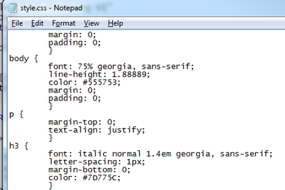
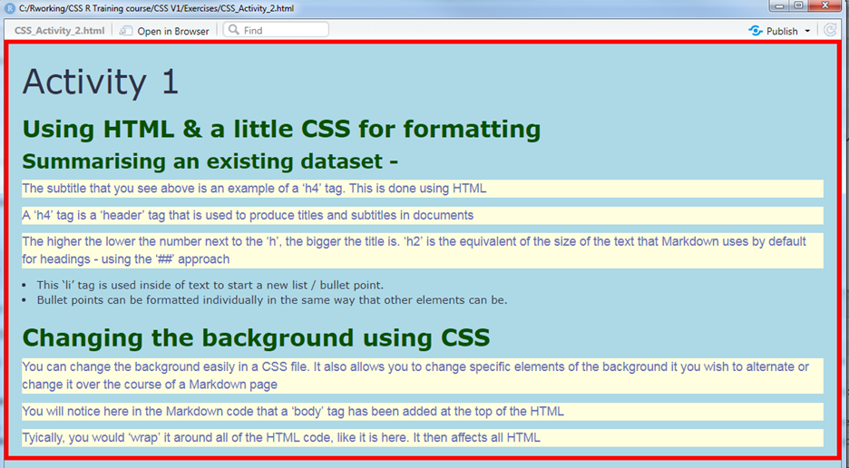

# What is CSS?

- CSS stands for Cascading Style Sheets
- They are typically used in conjunction with HTML to help style websites
- They aid with formatting and appearance, allowing for a consistent approach to be used
- Not exclusive to R - used in other programming languages such as Node.js

--

# Do I have to use it?

- No!  It is not required to build Markdown documents
- You can just choose to format area of text using HTML tags or 'free' text
- You may find Markdown's 'base formatting sufficient for your needs

---

# Pros and cons of using CSS

```{css, echo=FALSE}
th {
  background-color: #4CAF50;
  color: white;
}

#Code above is to overwrite the CSS styles from the HED.css example, specifically for this table only
```

```{r tbl1, echo = FALSE}
tbl1 <- tibble::tribble(
~`Pros`, ~`Cons`,
"Consistency across your document","Takes time to code",
"Able to share CSS files to help improve","Can be very sensitive to small changes",
"Simple coding, once you understand how it works","Doesn't always work as you expect it to!  Expect trial and error!",
"Has many options to improve visuals- I still learn new elements regularly!","Unless you code it in a certain way, it can appear differently from computer to computer",
"Well established","CSS files can be considerably lengthy in some instances",
"Has many more formatting options than basic Markdown"," "
)
library(knitr)
library(kableExtra)

dt <- tbl1
kable(dt) %>% 
  kable_styling(bootstrap_options = c("striped", "hover","condensed"))


```

---

# Markdown output without CSS

####Is the default style enough for you??

``` {css, echo=FALSE}
figcaption {
  font-style: italic;
  font-size: smaller;
  text-align: center;
}

.aligncenter {
    text-align: center;
}

```

.pull-left[
<figure>
  <p> 
  <figcaption> Original Markdown output
  </figcaption>
  </p>
</figure>
]

.pull-right[
<figure>
  <p> 
  <figcaption> How a dataset appears without formatting
  </figcaption>
  </p>
</figure>
]

---

# What do I need to code in CSS?

.pull-left[
- Notepad!  The most basic of all applications is sufficient
- R Studio also allows you to create text files you can save as CSS


<br>

* Better alternatives do exist - I prefer a program called 'Atom' (free!)
<br>
  + It has colour coding for tag/section/class identification
  + Code suggestions for open tags

]

.pull-right[
<figure>
  <p class="aligncenter"> 
  <figcaption> Notepad use in CSS
  </figcaption>
  </p>
</figure>

<figure>
  <p class="aligncenter"> 
  <figcaption> Atom view of CSS files
  </figcaption>
  </p>
</figure>

]

---

# Attaching and storing CSS files

At the top of a Markdown document, in the YAML section, you will have see a section that looks similar to the below - 
```{r eval=FALSE}
  title: "Trust review of LOS, 2018 - 2019"
  output:
  html_document:default
  pdf_document: default
```
--
A small change to the `html_document` property attaches a CSS file to the Markdown

```{r eval=FALSE}
  html_document:
    css:styles.css
```
--
## Locating files 

.pull-left[
In a simple implementation of CSS, keep CSS files in the same folder as the Markdown file.  You can however, use sub-directories
]

.pull-right[
<figure>
  <p> 
  <figcaption> Typical folder location
  </figcaption>
  </p>
</figure>
]

---

# HTML tags

+ Not essential for formatting Markdown, but important if you use CSS
+ They identify a section of HTML code and allow you to apply rules to it
+ All tags 'open' and 'close' in a particular way
  + Not following this method causes strange behaviour!

##How they work

+ All tags use angle brackets `<  >` to contain an identifier
+ Opening tags start of a tag and contain the identifier of what you are creating e.g. `<p>`
+ Closing tags use the same content as the opener, but you add a `/` before the content of the tag e.g. `</p>`

---

# Examples of HTML tags

| Code |  Purpose |
| :------------: | :------:|
| `<h4>` | Creates a header tag.  Used to make titles & subtitles|
| `<p>` | Creates a paragraph tag.  Used to put in standard/paragraphed text|
| `<li>`  | Creates a list tag.  Used to make a bullet pointed list|
| `<body>` | This is what HTML elements should be contained in e.g. text, hyperlinks, tables etc.
| `<div>` | Divides the HTML code up into a section, allowing you to refer to that specific block


---

# Internal vs external CSS

+ You can choose to either build your CSS into your Markdown file directly, or...
+ Put it into an external file (the route I prefer!)

--

## Think about your needs...

+ Internal/inline CSS code makes your Markdown file much longer, but it is in one place
+ External CSS means switching backwards and forwards, but is easier to find errors

--

## Today's use of CSS

+ Will be through external files
+ If you look at this Markdown file, you can see how internal CSS works

---

# CSS Rules

All CSS tags start and end with braces/curly brackets `{ }`.  For example -

```{CSS eval=FALSE}
{margin-top:0;
text-align:justify;}
```

<br>
--
CSS mainly uses classes or element selectors.  The key difference is the dot before the reference to the section.  An element selector has no dot -

```{CSS eval=FALSE}
h3 { position:absolute; }
```

<br>
--
A class has a dot before the name of the section  -

```{CSS eval=FALSE}
.sidebar { margin-left:600px;}
```

---
# Further CSS rules

Properties in a CSS file use a colon after the property identifier -

```{CSS eval=FALSE}
footer { text-align:center;}
```

--

At the end of each rule, a semi colon is used

```{CSS eval=FALSE}
header {padding-top:20px;}
```

--

To use a sub-class (change of a property inside of a class), put a space after the class name 
```{CSS eval=FALSE}
.sidebar ul {margin : 0;}
```

--

##Tip of the iceberg...

Go to https://www.w3schools.com/css/ for many more examples

---

# Quick CSS reference guide & examples

| CSS Property | Example | Purpose |
| :------------: | :------:| :-------:|
| margin |`margin-top:100px`|Puts a buffer/margin on the side of something|
| color | `<h1 style=background-color:DodgerBlue;>`|Simply sets the colour of that element.  Can use names or hexadecimal values|
| padding |`div{padding-top:50px};`|Allows a section of space around the area to be added|
| Font-family, font-size | `font-family: Arial; font-weight: bold;`|Allows you to select a specific font(e.g. Arial), size (e.g. 12) and weight (e.g. bold)


---

#Activity 1

| Choice 1 | Choice 2 | Choice 3 |
| :------------: | :------:| :-------:|
| Use an existing R Markdown template I have created and tackle the areas that are commented out (CSS_Activity_1.rmd) in the 'Exercises' folder | Produce an R Markdown with HTML and CSS from scratch that utilise these skills | Adapt an existing R Markdown file that you have used in today's sessions

<br>
<br>

Extension - Add in stylings for bullet points / list elements in your CSS file (may need research)

<br>
<br>

### Look for the below in the code for where to action areas -

``` {diff eval=FALSE}
-<!-- Insert some text below that can be used to introduce the cars dataset (inside the 'p' tags) -->
<p>  </p>
<p>  </p>
<p>  </p>
```
---

# Body formatting

+ Affects ALL elements of the HTML section, unless overriden with other HTML tags
+ For example, adding a `<p>` tag into your body code means that text will then follow the rules of the `<p>` tag, rather than the body tag rules
+ Do not ignore body formatting!  We will investigate this more in the next activity

<br>

# Backgrounds in CSS

* Backgrounds be changed in CSS at various levels including -
  + Overall 'body', header, div tags (looked at later), paragraphs and many more
+ Can use the usual colour formatting style e.g. hex, RGB, name values, or can use images

---

# Code examples

```{CSS eval=-FALSE}

body { background-color:lightblue;
}

h1   { background-color:lightblue;
}

div  { background-color:lightblue;
}

p    { background-color:lightblue;
}
```

<br>

Examples above showing you to use CSS to respectively change the body, h1, div and p tag content in your document

---

# More complete example and output

.pull-left[

``` {CSS eval=FALSE}

p {
 font-family: Arial;
 font-size: 14px;
 color: #6870B8;
}

body{
  font-family: Verdana;
  font-size:12px;
  color: #303248;
}


```
]
.pull-right[

<figure>
  <p class="aligncenter"> 
  <figcaption> Output in Markdown
  </figcaption>
  </p>
</figure>

]

---

# Borders in CSS

+ These create 'zones' and borders around text in the same way you would in any application
+ Can choose to put a border around the whole body, some it, individual parts etc.
+ One extra line of code in a CSS section e.g. - `border: 5px solid red;`

<figure>
  <p class="aligncenter"> 
  <figcaption> Output in Markdown
  </figcaption>
  </p>
</figure>

Further options available at https://www.w3schools.com/css/css_border.asp

---

# Activity 2

+ Add in a suitable 'body' tag in the R Markdown code around the areas that you wish to use it in (you can just keep it as it is, if preferred)
+ Add in background-color (forgive the Americanisation!) property tags into the CSS file for relevant tags of your choice
+ Try using a text and hex value for the colours so that you are aware of how to do it either way
+ Add in some borders to your CSS text.  Try and keep them relevant and not random!

<br>

As before, a 'complete' example of this can be seen in the file called `styles(Activity_2_complete).css`


---

# Using images in a CSS file

+ By using the `background-image` property, you can add a picture to your background  
+ This could be a logo or something similar to represent your trust
+ The default view for this is for the image to repeat itself (if it is not large enough to fit the whole page)

<br>

The code might look like this - 

``` {CSS eval=FALSE}

body {  background-color: #fff;
        background-position: right top;
        background-image: url("Rightblox2.png");
        display: table-cell;
}
```
---

# Some caveats of default background images


---


# Closing remarks

+ We have built a CSS file here in stages to see what individual components do 
+ One of the best ways to learn is to experiment with an existing CSS file and make changes


