class: center, middle

<br><br><br><br><br><br>

# Introduction to `Rmarkdown`

__Chris Mainey__
<br>
__Matthew Bass__
<br>
__Anthony Harmon__

<a href="mailto:HED@uhb.nhs.uk">HED@uhb.nhs.uk</a>

<br><br>
2020-01-20 (updated: `r Sys.Date()`)
<br><br><br><br>
<span style="font-size:14px !important;"> __&copy; Healthcare Evaluation Data (HED)__- part of Health Informatics, University Hospitals Birmingham NHS Foundation Trust.  
<b>NOT TO BE REPUBLISHED OR DISTRIBUTED WITHOUT CONSENT</b> </span>

---

# RStudio Cloud

We are using RStudio cloud for this course.

+ Browser-based RStudio session
+ All materials are pre-loaded
+ Material will be available on GitHub afterwards for two weeks
+ We will send round details after the course

<br><br>
### Please go to the following link and register for the workspace:
# https://bit.ly/38Z0kre


---

# Course Content

- What is `R` markdown?
- Structure
- Formats
- Output types
 - HTML & CSS
 - PDF / Latex
 - MS Office
- Parametrisation
 - Including and using prarmeters
 - Automating reports

_(Plus coffee, and lunch, of course...)_
---

## What is it?


<div style="text-align: center;"> <span style="font-size: 14px;"> Artwork by <b>@allison_horst</b></span></div>

<br>


Sections of this course are based on the free ebook: __R Markdown: The Definitive Guide__ by _Yihui Xie, J. J. Allaire, Garrett Grolemund_
https://bookdown.org/yihui/rmarkdown/

---

# What is Rmarkdown

`Markdown` (.md) is a common free-text format.  
- Originally by 
[John Gruber](https://daringfireball.net/projects/markdown/), simple communication medium for writers
- Text to HTML tool
- Initially limited syntax, but signficantly enriched over time

--

`Pandoc`
- Written by [John McFarlane](http://pandoc.org/), a universal document converter
- Allows markdown to be parsed to other formats like Latex, with powerful formatting
- Latex can then be converted to PDF and others

--

`Rmarkdown`
- Created by Yihui Xie, to embed code chunks in markdown
- Expanded to include fine control of elements
- Intergrated in RStudio environment
- Lots of extensions 


---


# Why would I want to use it?

You can write a single document with all your text, code and graphics in the same place.
<br>
It could also be used as a final report, teaching material, blog post etc.

.pull-left[
### Advantages:
+ Collaborate and share well-formatted reports, or notebooks.
+ Write your documentaion as you go.
+ Reproducible
+ Can be used as both scripts and final reports (and more...)
+ Can be parameterised to build regular reports / multiple versions.
]

.pull-right[
### Challenges
+ Requires some `R` knowledge
+ Output formats can be tricky at first, particularly with PDF
+ Works best if shared.  Difficult if lone analyst using it.

]


---

## Software (available for free)

+ `R`

--

+ RStudio

--

## R Packages (available for free on CRAN)

+ rmarkdown

--

+ tidyverse

--

+ xaringan

--

+ ggplot2

--

+ DT

+ flextable

+ kable & kableExtra

+ redoc

---

# Document Structure

Markdown documents are composed of three main elements:

+ Metadata
+ Text
+ Code

--

<br>
Other elements, depending on the output, might be:
+ CSS files
+ JavaScript
+ HTML 'widgets'
+ Shiny apps

---

# Metadata: YAML

The metadata of a markdown file is the first thing you see at the top of the document.  

+ It sets properties like document name, author but also functional elements like:
  + File locations
  + Output formats (HTML, PDF, Word etc.)
  + Styling elements, including CSS
--
<br><br>
+ It is written in __YAML__ - ('YAML Ain't Markup Language') [Wikipedia article](https://en.wikipedia.org/wiki/YAML)
  - Reference: https://bookdown.org/yihui/bookdown/yaml-options.html
  
```yaml
---
title: "An introduction to Rmarkdown"
author: "Chris Mainey"
date: "16/05/2019"
output: 
  html_document
  word_document
bibliography: references.bib
---
```

---

# Text

Free-text is treated as such, and coded as a paragraph `<p>` element in HTML.  Other formatting is achieved using special characters, pandoc, HTML etc.

--

.pull-left[

```text

+ Bullet 1

  + Bullet 2


# Heading 1


## Heading 2


### Heading 3


_italic_ and __bold__


[BBC News](www.bbc.co.uk/news)
```
]


.pull-right[
+ Bullet 1
  + Bullet 2

# Heading 1
## Heading 2
### Heading 3

_italic_ and __bold__

[BBC News](www.bbc.co.uk/news)
]

---
class: left, middle

# Exercise 1: 
## Build an `Rmarkdown` document from template

+ Use the `File` menu to create a new R Markdown document
+ Read through it and see the formatting
+ 'knit' the document together, using the `knitr` package, button at the top
+ Look at the output

---

# Code Chunks (1)

Blocks of code in R, SQL, Python and other languages can be run as part of the document in __chunks__.
The result of the code can be shown on its own, with the code chunk or not at all.

--

```{r plotexample, fig.align='center', fig.height=4.3, fig.width=5, message=FALSE, warning=FALSE}
library(ggplot2)
data(mtcars)
ggplot(mtcars, aes(x=mpg))+
  geom_histogram(col=1,fill="orange", alpha=0.75,bins=10)+
  ggtitle("Miles per gallon (mpg) of cars in 'mtcars' dataset")

```


---

# Code Chunks (2)

Start and end code chunks with three backticks 

The last section looked like this:

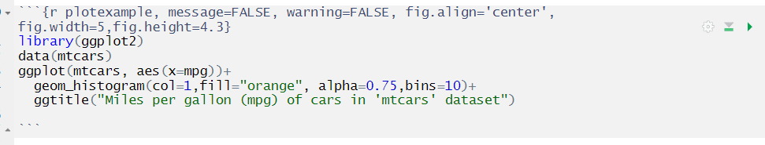

The chunk header is inside {curly brackets}. We gave it the language (r), a name for the chunk ('plotexample'), 
turned warnings and messages off, and set options for figure alignment and size.

<br>
Import, clean and process data, then produce the figure all in one place.

---

# Chunk Options

There are a lot of options for code chunks, but here are some of the important ones:
+ eval=FALSE -  __Don't evaluate/run the code block__
+ echo=FALSE -  __Don't display the code block__
+ include=FALSE -  __Run the code but don't include in final document__
+ collapse = TRUE -  __Merge the code and all outputs into a single chunk for display__
+ message = FALSE - __Don't print messages generated by the code__
+ warning = FALSE - __Don't print errors generated by the code__

<br>

Can also be changed in RStudio by clicking on the cog in the top right of the code chunk


---

# Inline Code

Code can be run within the text by surrounding it with <code>&#96;r &#96;</code>

<br>

Insert numeric values and change the text with conditional statements

<br>

--

.pull-left[
The sum of 4 and 5 is <code>&#96;r 4+5&#96;</code>

<br>

4 is <code>&#96;r if(4>5){"greater than"} else {"less than"}&#96;</code> 5
]

.pull-right[
&rarr; The sum of 4 and 5 is `r 4+5`

<br>

&rarr; 4 is `r if(4>5){"greater than"} else {"less than"}` than 5
]

---
class: left, middle

# Exercise 2: 
### Build an `Rmarkdown` doc using `LOS_model`

+ Create a new markdown document or clear your last one.
+ In this document, please do the following:
 + Create a hidden code block that loads the LOS_model data
 + Add some titles and text to explain what is happening
 + Add a hyper-link to the `NHSRdataset` package (find it via Google)
 + Add a code block using `dplyr` to summarise the `mean` and `median` LOS
 + Create a chart/histogram of the LOS
 
---
class: middle, left 

# Formatting R markdown documents

---

# You want to make it look nice!

Three common elements:
+ Figure sizes
+ Presenting data tables
+ Consider output style (later section)


--

## Figure sizes

Five main options: `fig.width`, `fig.height`, `fig.asp`, `out.width`, `out.height`

+ `fig.width` and `fig.height` are in inches (_America..._).
+ __Golden ratio:__ set fig.width = 6 and fig.asp = 0.618 (Hadley Wickham, R4DS)
+ `out.width` controls proporiton of line width, e.g. "70%"
+ To tile two plots across page, set `out.width = "50%"` and `fig.align = "default"`

---

# Static Markdown tables

If you are not presenting a data set, but want a table, you can use markdown syntax:
<br><br>

```{r mdtbl1, eval=FALSE}
|Presenters    | Favourite Drink | Favourite R package     |
|:-------------|-----------------|------------------------:|
|Matthew Bass  | Pepsi           | `data.table`            |
|Anthony Harmon| A good, peaty, single malt| `xaringan`     |
|Chris Mainey  | Coffee          | `mgcv`                  |
```


<br><br>

|Presenters    | Favourite Drink | Favourite R package     |
|:-------------|:---------------:|------------------------:|
|Matthew Bass  | Pepsi           | `data.table`            |
|Anthony Harmon| A good, peaty, single malt| `xaringan`     |
|Chris Mainey  | Coffee          | `mgcv`                  |


---

# Kable

+ Kable is an R package that allows for advanced table formatting
+ 'Standard' views of tables can be dull without any styling applied
+ Kable code is simple and allows for easy, pleasant output

``` {r, include=TRUE, echo=TRUE, warning =FALSE}
library(NHSRdatasets)
data("LOS_model")
LOS_summary <- (summary(LOS_model))
library(kableExtra)
dt <-  LOS_model
head(dt) %>%    # Only shows the first 6 lines of the table
  kable() %>%
  kable_styling()   # Applies the 'Twitter' bootstrap styling
 
```

---

# More Kable

``` {r, include=TRUE, echo=TRUE, warning =FALSE}

dt[1:2, 1:5] %>%    
  kable %>% 
            # The additional parameters in the line below adds striping to the table and stops
            # it from spreading across the full page (this is overridden by our CSS file)
  kable_styling(bootstrap_options="striped", full_width = F) 
  

```

---
class: middle, left

## Exercise 3: 

+ Create a new Rmarkdown file, or use an existing one created from earlier
+ Print the `LOS_model` table using Kable format (using the `head` function will make it more manageable)
+ You can use the example above, and stick to the same styling, or experiment with other Kable options
+ Try and use the `summarise` and `mean` / `median` functions with the Kable table for a second output
+ Look at the vignette -`vignette("awesome_table_in_html")`

---
# HTML Tables with `DT`

+ Creates HTML tables from R data frames and includes filters, searching and pagination

+ Can be used in interactive Rmarkdown documents, shiny apps and html outputs

```{r using_DT, message=FALSE, warning=FALSE}
library(NHSRdatasets)
library(DT)
data(LOS_model)

datatable(LOS_model, options = list(pageLength = 5))
```

---

# Tables with `flextable`

```{r using_flextable_shown, message=FALSE, warning=FALSE, eval=FALSE}
library(NHSRdatasets)
library(flextable)
library(dplyr) # for %>% and arrange()
data(LOS_model)

flextable(data = LOS_model %>% arrange(Organisation, Death, ID) #order the data
          , col_keys = c("Organisation", "Age", "LOS", "Death") #display these columns (not ID)
          ) %>%
  merge_v(j = c("Organisation", "Death")) %>% # merge the Organisation and Death columns
  valign(j = c("Organisation", "Death"),valign = "top") # move the merged column entries to the top
```

.pull-left[
+ Creates well formatted tables that will render in html, pdf, Word and Powerpoint.
+ Can also 'plot' the tables as images
+ Excellent range of formatting options including fonts, borders, merging, cell sizes, etc.
]

.pull-right[

```{r using_flextable_hidden, message=FALSE, warning=FALSE, echo=FALSE}
library(NHSRdatasets)
library(flextable)
library(dplyr) # for %>% and arrange()
data(LOS_model)

flextable(data = LOS_model %>% arrange(Organisation, Death, ID) #order the data
          , col_keys = c("Organisation", "Age", "LOS", "Death") #display these columns (not ID)
          ) %>%
  merge_v(j = c("Organisation", "Death")) %>% # merge the Organisation and Death columns
  valign(j = c("Organisation", "Death"),valign = "top") # move the merged column entries to the top
```

]


---

# Output Styles


https://yihui.org/knitr/


---

# Output styles

As menitoned earlier, there are various output styles you can use, including:

+ beamer_presentation
+ github_document
+ html_document
+ ioslides_presentation
+ latex_document
+ md_document
+ odt_document
+ pdf_document
+ powerpoint_presentation
+ rtf_document
+ slidy_presentation
+ word_document

---

# PDF output

+ Output style `pdf_output`.

+ PDF is a tricky format, but Pandoc is your friend.

+ Default PDF output converts markdown to Latex, and Pandoc converts Latex to PDF.

--

+ This means that you can use Latex commands in YAML and formating, but you need Latex installed.

+ Easiest way is: `install.packages("tinytex")` 

--

+ You many have trouble with firewalls and mirrors being blocked.


#### Reference:  https://bookdown.org/yihui/rmarkdown/pdf-document.html

---

# Useful Latex for YAML in PDF

|Option |Description |
|:------|:-----------|
|toc| Include a table of contents (true/false)|
|toc_depth| Set the depth of the table of contents|
|number_sections| Number each of the section titles and toc (true/false)
|geometry| Options for geometry class (e.g., `margin=1in`)|
|df_print| Enhanced display type for tables (default/kable/tibble)|
|dev| Graphics device to use, e.g. Cairo|
|keep_tex| Keep the intermediate Tex (true/false)|
|template| Use a latex (.tex) template|
|fontsize| Font size (e.g. `10pt`)|

---

# pagedown

+ An alternative to the complicated PDF generation is the `pagedown` package.

+ It doesn't require the Latex translation, and offers paginated HTML

+ `pagedown` has templates for webpages, thesis, posters, CV, business cards, journals etc.

```{YAML, eval=FALSE}
---
title: My Report
Name: Chris Mainey
output:
  pagedown::html_paged:
    toc: true
    number_sections: true
    self_contained: true
    front_cover: https://i.imgflip.com/30tnps.jpg
    back_cover: https://www.r-project.org/Rlogo.png
  
---

```

---
class: middle, left

# Exercise 3.5

Knit your document together as a PDF using both the default `pdf_output` and `pagedown`.


---
class: middle, left 

# HTML & CSS

---
# What is CSS?

- CSS stands for Cascading Style Sheets
- They are typically used in conjunction with HTML to help style websites
- They aid with formatting and appearance, allowing for a consistent approach to be used
- Not exclusive to R - used in other programming languages such as Node.js


---

# What do I need to code in CSS?

.pull-left[
- Notepad!  The most basic of all applications is sufficient
- R Studio also allows you to create text files you can save as CSS


<br>

* Better alternatives do exist - I prefer a program called 'Atom' (free!)
<br>
  + It has colour coding for tag/section/class identification
  + Code suggestions for open tags

]

.pull-right[
<figure>
  <p class="aligncenter"> 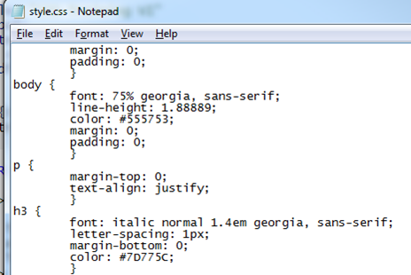
  <figcaption> Notepad use in CSS
  </figcaption>
  </p>
</figure>

<figure>
  <p class="aligncenter"> 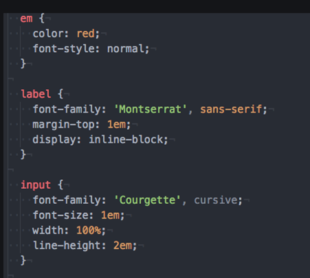
  <figcaption> Atom view of CSS files
  </figcaption>
  </p>
</figure>

]

---

# Attaching and storing CSS files

At the top of a Markdown document, in the YAML section, you will have see a section that looks similar to the below - 
```{r eval=FALSE}
  title: "Trust review of LOS, 2018 - 2019"
  output:
  html_document:default
  pdf_document: default
```
--
A small change to the `html_document` property attaches a CSS file to the Markdown

```{r eval=FALSE}
  html_document:
    css:styles.css
```
--
## Locating files 

.pull-left[
In a simple implementation of CSS, keep CSS files in the same folder as the Markdown file.  You can however, use sub-directories
]

.pull-right[
<figure>
  <p> 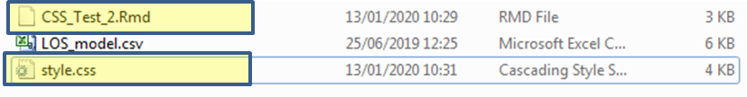
  <figcaption> Typical folder location
  </figcaption>
  </p>
</figure>
]

---

# HTML tags

+ Not essential for formatting Markdown, but important if you use CSS
+ They identify a section of HTML code and allow you to apply rules to it
+ All tags 'open' and 'close' in a particular way
  + Not following this method causes strange behaviour!

##How they work

+ All tags use angle brackets `<  >` to contain an identifier
+ Opening tags start of a tag and contain the identifier of what you are creating e.g. `<p>`
+ Closing tags use the same content as the opener, but you add a `/` before the content of the tag e.g. `</p>`

---

# Examples of HTML tags

| Code |  Purpose |
| :------------: | :------:|
| `<h4>` | Creates a header tag.  Used to make titles & subtitles|
| `<p>` | Creates a paragraph tag.  Used to put in standard/paragraphed text|
| `<li>`  | Creates a list tag.  Used to make a bullet pointed list|
| `<body>` | This is what HTML elements should be contained in e.g. text, hyperlinks, tables etc.
| `<div>` | Divides the HTML code up into a section, allowing you to refer to that specific block


---

# Internal vs external CSS

+ You can choose to either build your CSS into your Markdown file directly, or...
+ Put it into an external file (the route I prefer!)

--

## Think about your needs...

+ Internal/inline CSS code makes your Markdown file much longer, but it is in one place
+ External CSS means switching backwards and forwards, but is easier to find errors

--

## Today's use of CSS

+ Will be through external files
+ If you look at this Markdown file, you can see how internal CSS works

---

# CSS Rules

All CSS tags start and end with braces/curly brackets `{ }`.  For example -

```{CSS eval=FALSE}
{margin-top:0;
text-align:justify;}
```

<br>
--
CSS mainly uses classes or element selectors.  The key difference is the dot before the reference to the section.  An element selector has no dot -

```{CSS eval=FALSE}
h3 { position:absolute; }
```

<br>
--
A class has a dot before the name of the section  -

```{CSS eval=FALSE}
.sidebar { margin-left:600px;}
```

---
# Further CSS rules

Properties in a CSS file use a colon after the property identifier -

```{CSS eval=FALSE}
footer { text-align:center;}
```

--

At the end of each rule, a semi colon is used

```{CSS eval=FALSE}
header {padding-top:20px;}
```

--

To use a sub-class (change of a property inside of a class), put a space after the class name 
```{CSS eval=FALSE}
.sidebar ul {margin : 0;}
```

--

##Tip of the iceberg...

Go to https://www.w3schools.com/css/ for many more examples

---

# Quick CSS reference guide & examples

| CSS Property | Example | Purpose |
| :------------: | :------:| :-------:|
| margin |`margin-top:100px`|Puts a buffer/margin on the side of something|
| color | `<h1 style=background-color:DodgerBlue;>`|Simply sets the colour of that element.  Can use names or hexadecimal values|
| padding |`div{padding-top:50px};`|Allows a section of space around the area to be added|
| Font-family, font-size | `font-family: Arial; font-weight: bold;`|Allows you to select a specific font(e.g. Arial), size (e.g. 12) and weight (e.g. bold)


---

# Exercise 4

| Choice 1 | Choice 2 | Choice 3 |
| :------------: | :------:| :-------:|
| Use an existing R Markdown template I have created and tackle the areas that are commented out (Ex4_CSS_Activity.rmd) in the 'Exercises' folder | Produce an R Markdown with HTML and CSS from scratch that utilise these skills | Adapt an existing R Markdown file that you have used in today's sessions

<br>
<br>

Extension - Add in stylings for bullet points / list elements in your CSS file (may need research)

<br>
<br>

### Look for the below in the code for where to make changes -

``` {diff eval=FALSE}
-<!-- Insert some text below that can be used to introduce the cars dataset (inside the 'p' tags) -->
<p>  </p>
<p>  </p>
<p>  </p>
```
---

# Body formatting

+ Affects ALL elements of the HTML section, unless overriden with other HTML tags
+ For example, adding a `<p>` tag into your body code means that text will then follow the rules of the `<p>` tag, rather than the body tag rules
+ Do not ignore body formatting!  We will investigate this more in the next activity

<br>
--

# Backgrounds in CSS

* Backgrounds be changed in CSS at various levels including -
  + Overall 'body', header, div tags (looked at later), paragraphs and many more
+ Can use the usual colour formatting style e.g. hex, RGB, name values, or can use images

---

# Code examples

```{CSS eval=-FALSE}

body { background-color:lightblue;
}

h1   { background-color:lightblue;
}

div  { background-color:lightblue;
}

p    { background-color:lightblue;
}
```

<br>

Examples above showing you to use CSS to respectively change the `body`, `h1`, `div` and `p` tag content in your document

---

# More complete example and output

.pull-left[

``` {CSS eval=FALSE}

p {
 font-family: Arial;
 font-size: 14px;
 color: #6870B8;
}

body{
  font-family: Verdana;
  font-size:12px;
  color: #303248;
}


```
]
.pull-right[

<figure>
  <p class="aligncenter"> 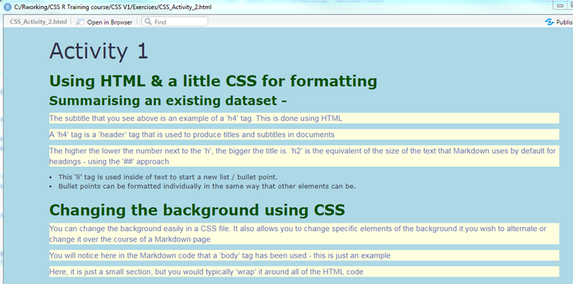
  <figcaption> Output in Markdown
  </figcaption>
  </p>
</figure>

]

---

# Borders in CSS

+ These create 'zones' and borders around text in the same way you would in any application
+ Can choose to put a border around the whole body, some it, individual parts etc.
+ One extra line of code in a CSS section e.g. - `border: 5px solid red;`

<figure>
  <p class="aligncenter"> 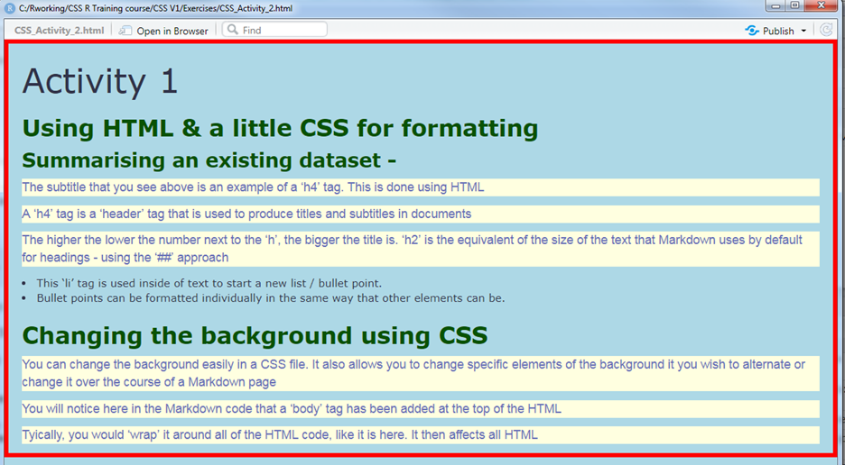
  <figcaption> Output in Markdown
  </figcaption>
  </p>
</figure>

Further options available at https://www.w3schools.com/css/css_border.asp

---

# Exercise 5

+ Add in a suitable 'body' tag in the R Markdown code around the areas that you wish to use it in (you can just keep it as it is, if preferred)
+ Add in background-color (forgive the Americanisation!) property tags into the CSS file for relevant tags of your choice
+ Try using a text and hex value for the colours so that you are aware of how to do it either way
+ Add in some borders to your CSS text.  Try and keep them relevant and not random!

<br>

As before, a 'complete' example of this can be seen in the file called `styles(Ex5_CSS_complete).css`


---

# Using images in a CSS file

+ By using the `background-image` property, you can add a picture to your background  
+ This could be a logo or something similar to represent your trust
+ The default view for this is for the image to repeat itself (if it is not large enough to fit the whole page)

<br>

The code and output might look like this (not good!) - 

| Code   | Output   |
|------|--------|
|` body`<br>`{  background-color: #fff;`<br> `background-position: right top;` <br> `background-image:url("Rightblox2.png");`<br>`display: table-cell;`<br>`}`|<p class="aligncenter">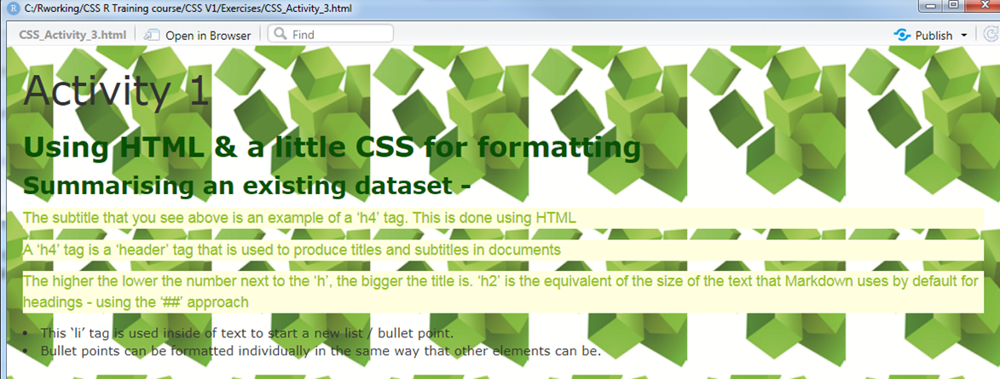</p></figure> |


---

#  Fixing backgrounds

By adding a line using `background-repeat`, you can prevent the image from repeating.  With a few extra tweaks, the final output is much better
<br>
<br>

| Code   | Output    |
|------|--------|
|` body`<br>`{  background-position: right top;`<br> `background-image: url("Rightblox2.png");` <br> `background-repeat: no-repeat;`<br>`display: table-cell;`<br>`}`|<p class="aligncenter">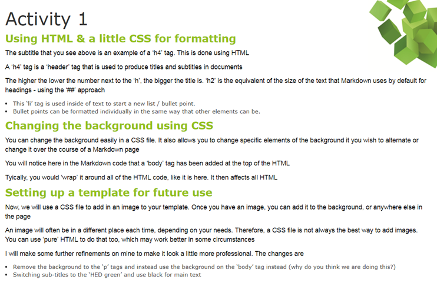</p></figure> |

---

# Using data in Markdown

+ You have already seen how to use data in Markdown
+ You can use additional formatting to improve the appearance of these outputs
+ When using the summary function, some data that you see is less relevant than others
<br>
<br>
For example, the highlighted columns below are irrelevant in this context
<br>
<br>
``` {r echo=FALSE} 
library(NHSRdatasets)
data("LOS_model")
LOS_summary <- (summary(LOS_model))
library(kableExtra)

```
``` {r echo = FALSE}

kable(LOS_summary) %>%
  kable_styling(full_width = F) %>%
  column_spec(1:3, background = "yellow")
```
---

# Improving summary output

Using the `within` function, you can remove column names from the output

<br><br>

``` {r, echo=-3, include =TRUE, collapse=TRUE}
LOS_summary <-  within(LOS_model, rm(ID,Organisation))
LOS_without_columns <- summary(LOS_summary)

LOS_without_columns
```

---

# Exercise 6

+ If you wish to use Markdown for making reports that are specific to your trust, why not start by making a suitable template today!
+ In the `Ex6_CSS_complete.css` CSS file in the library, you will see some part customisation towards 'HED' colours.  
+ All I have done here is change a few elements around and it is now similar to HED's

---

# Messy HTML in Markdown!

<figure>
  <p> 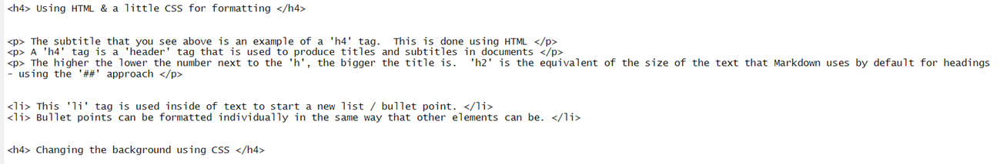
  <figcaption> In R Studio, HTML is not colour coded and blends in too easily
  </figcaption>
  </p>
</figure>


<figure>
  <p> 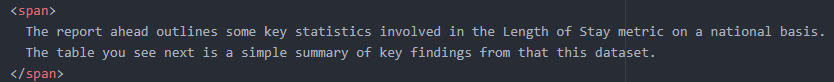
  <figcaption> In programs like Atom, proper colour coding helps to seperate out 
  </figcaption>
  </p>
</figure>

<br>

It is not always necessary to use pure HTML tags in Markdown.  Fully removing HTML is not wise, as you lose some of the unique abilities & facilities it provides.

<br>

There is however, a compromise...

---

# The compromise

<figure>
  <p> 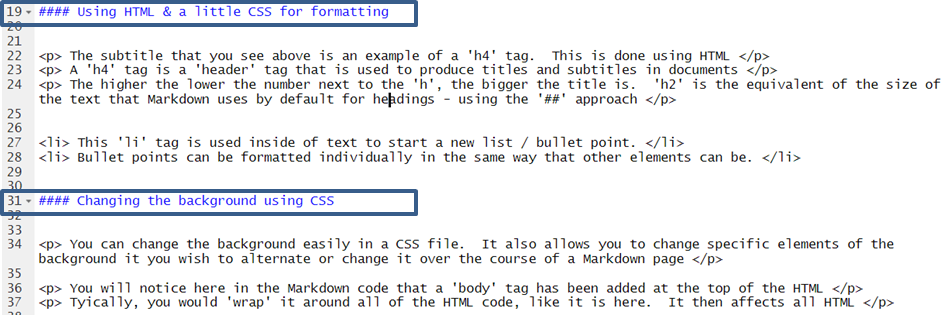
  <figcaption> The h4 tags have been replaced with four hashtags, which means the same thing in Markdown
  </figcaption>
  </p>
</figure>

<br>
<figure>
  <p> 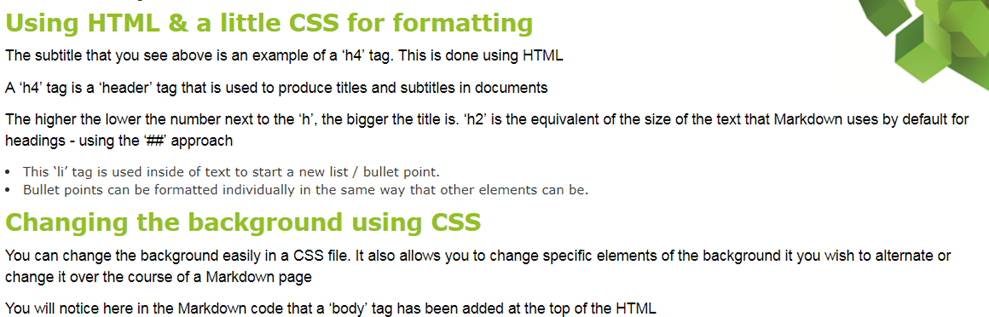
  <figcaption> Identical output to using the h4 tags
  </figcaption>
  </p>
</figure>

---

# Span tags

+ We have used `<p>` tags so far to enclose text
+ Span tags can be used to enclose multiple lines of text, saving time
+ You need to add a span reference in your CSS file.  You then use span tags in HTML sections

``` {CSS eval = FALSE}

# CSS coding
span {
  font-family: Verdana;
  font-size: 14px;
  color:darkblue;
}
```
``` {HTML eval = FALSE}
# HTML coding
<span>
  The report ahead outlines some key statistics involved in the Length of the Stay metric on a national basis.  The table you see next is a simple summary of key findings from this dataset.
</span>
```
<br>
<figure>
  <p> 
  </p>
</figure>

---

# More adjustments

+ Span is just the start of what we can change.  We can adjust other parts of the CSS file
+ We have used properties in our `body` section that could interfere with our `span` tag
+ If you wanted to use a span tag to apply to all text, we would no longer need the 'p' tag in our CSS file
<br>

``` {CSS eval=FALSE}
body{
  border: 2px #94C11F;
  background-color: #fff;
  background-position: right top;
  background-image: url("Rightblox2.png");
  background-repeat: no-repeat;
  display: table-cell;
}
span {
  font-family: Verdana;
  font-size: 14px;
  color:darkblue;
}
```

<br>
<br>
The body tag no longer includes references to the text size, colour or style.

The span tag now includes the font details that were in the previous 'body' tag

---

# Classes vs element selectors

+ Reminder - No dot before a selector means it <i> directly</i> affects a HTML element
<br><br>
Example -
``` {CSS eval=FALSE}
p{
  font-family:Arial;
}
```
<br><br>
+ This is the approach we have taken so far in the CSS section.  Now we will look at classes
+ A class in CSS has a dot before the selector, which has to be specifically referred to in the HTML

---
# Using classes with lists

.pull-left[

``` {CSS eval=FALSE}

# CSS

.listformat {
  font-family: Arial;
  font-size: 14px;
  color: darkgreen;
}
```
``` {HTML eval=FALSE}
# HTML

<span class ="listformat>
Your text to go here
Your text to go here
Your text to go here
Your text to go here
</span>
```

<br>
<figcaption> A new class has been added here called 'listformat' (can be called whatever you wish). <br><br>  This is then referred to in the HTML tags by using the 'class' addition to the right of the word 'span'. </figcaption>
]
.pull-right[
<figure>
  <p> 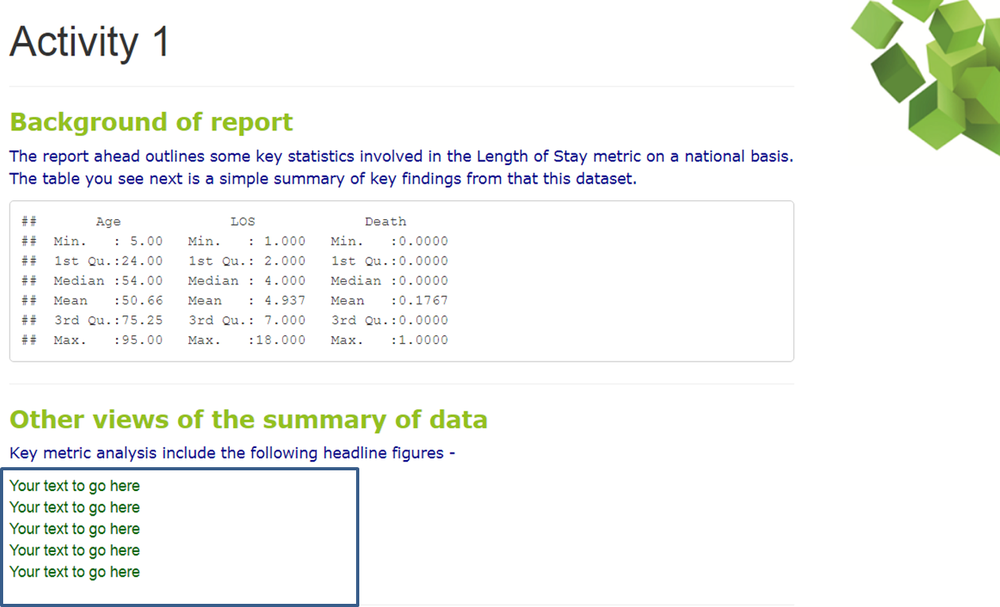
  </p>
  <figcaption> The output from running the HTML & CSS</figcaption>
</figure>
]

---

# Tidied up further

.pull-left[

``` {HTML eval=FALSE}
# HTML

<span class ="listformat">
Your text to go here
Your text to go here
Your text to go here
Your text to go here
</span>
```

<br>
<figcaption> The R HTML/Markdown code used with the new class structure </figcaption>
]
.pull-right[
<figure>
  <p> 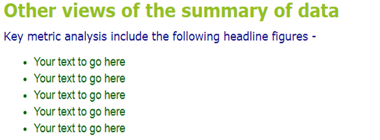
  </p>
  <figcaption> The new output using the 'body' class</figcaption>
</figure>
]

---

# Space: The Final Frontier


<figure>
  <p> 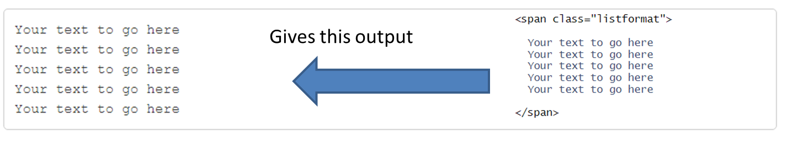
  </p>
</figure>


<figure>
  <p> 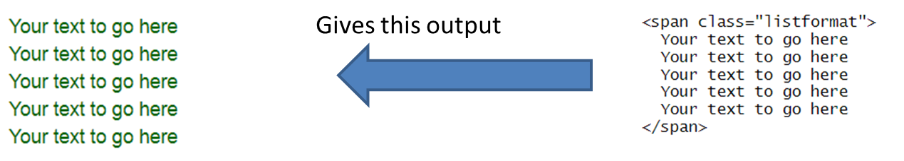
  </p>
</figure>

<br>
<br>
Warning!  The span tag in Markdown in particular is VERY sensitive to extra and unnecessary spaces/line breaks! For example -

---

## Exercise 7 - Combining Markdown & HTML

+ Refine your R Markdown file so that it has a 'best of both worlds' approach - some Markdown, some HTML
+ Use HTML if you have something in particular in mind that you would like to do in Markdown that isn't possible with built-in options, but, for straight forward text and titles, tags can be overkill

### Extended

+ We haven't used these so far, but you may find 'div' tags useful, 
+ Or, using the newer HTML5 standards, the layout elements such as 'header' & 'section'
+ These all allow for your page to be split up into sections, personalising each part
+ Try it yourself!  Feel free to look at `styles(Ex_7_complete).css` and `Ex7_CSS_complete.rmd`

---

# Using images

+ Inserting images is an inevitable requirement
+ Like other CSS/HTML elements, you can apply properties in image tags across all images
+ The image example looked at so far for our CSS background is  different to how it is done elsewhere in HTML
+ If you have used the `align` attribute in the past, HTML5 has changed things...

.pull-left[
```{HTML eval=FALSE}
.center {
  display:block;
  margin-left: auto;
  margin-right: auto;
  width: 50%
}

<section>
  <p> 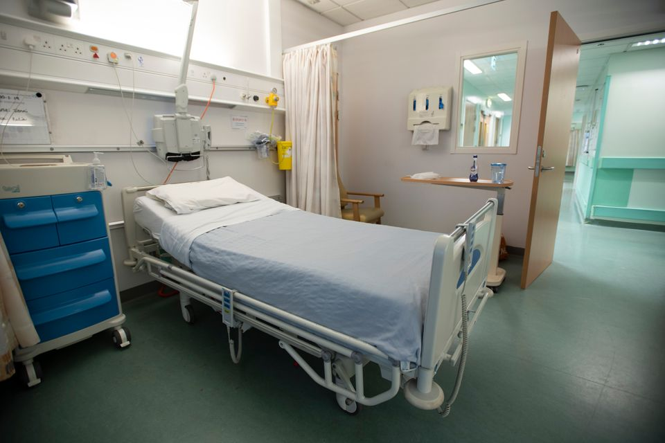 </p>
</section> 
```
]
.pull-right[
<section>
  <p>  
  </p>
</section> 
]

---

# Figures and captions

+ You can make reports more professional by using a 'figures' and 'captions' approach
+ Needs a little more coding, but it's well worth it!
``` {CSS eval = FALSE}
# CSS coding

figure {
  float: left;
  border: thin silver solid;
  margin: 0.5em;
  padding: 0.5em;
}
img.scaled {
  width: 50%;
}
figcaption {
  font-size: 0.9em;
  font-style: italic;
  color: grey;
  margin-right: 10%;
  margin-left: 10%;
  text-align: center;
}
```

--

``` {HTML eval=FALSE}
# HTML coding

<figure>
  <p>
  <figcaption> As of September 2019, the average length of stay in England's NHS hospitals is 4.52 days </figcaption>
</figure>
```

---

# Output of figures & captions

<figure>
  <p>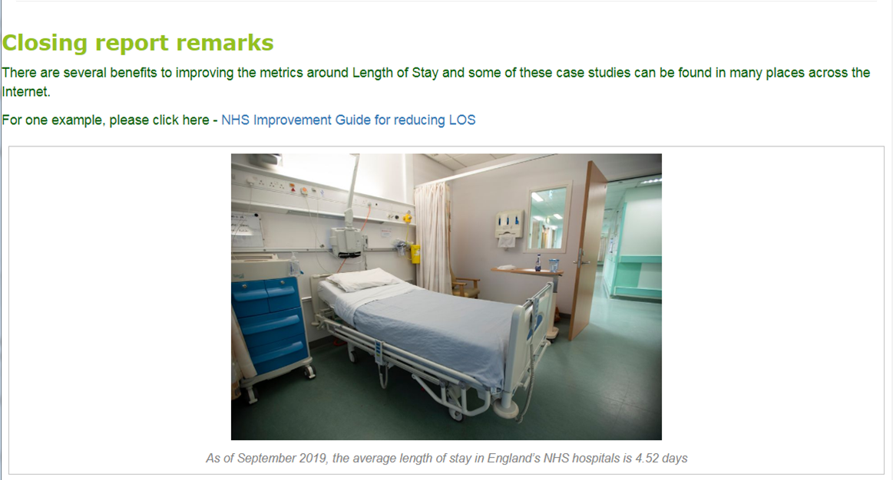


---

# Exercise 8

+ Add in a figure with an appropriate caption of your choice to your Markdown and CSS file.  
+ You will need to add in a new section to your CSS file to do this - a `figure` section and a `figcaption` section
+ If you wish to extend this further, you can also add in some 'normal' images that are not figures
+ There are ways to do this in Markdown without using HTML tags, but this session revolves specifically around the use of these!
+ An example of how to do this can be found in the file `Ex_CSS_Activity_8.rmd` on line 78

---

# Tidy CSS!

+ Over the course of this CSS session, you will have been adding in various CSS tags.  
+ Good practice with CSS tags in a file is to order them in alphabetical order
+ This makes it easier in future to find any areas that you need to modify or add to

.pull-left[

``` {CSS eval = FALSE}

body{
  border: 2px #94C11F;
}

.center {
  display:block;
}

figure {
  float: left;
}

figcaption {
  font-size: 0.9em;
}

```

]
--
.pull-right[
<br>
<br>
### Exercise 9
+ The final activity here is to rearrange your CSS tags in the file so that they are in alphabetical order
+ Be careful not to mix any areas up though - it could stop your CSS file from working
]

---

# Other methods of presentation

+ Respected data visualisation experts like Edward Tufte have produced styles, such as the 'Tufte handout' style, that can be easily reproduced in Markdown without the use of CSS files
+ For more details, have a look at the Bookdown section on this
<br><br>https://bookdown.org/yihui/rmarkdown/tufte-handouts.html

<figure>
  <p>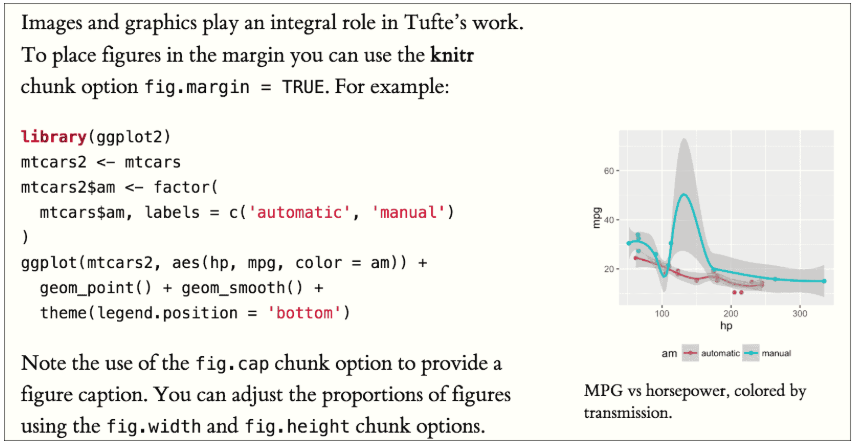
</figure>

---

# Other areas to consider investigating

| Method | Explanation | Website |
| :------------: | :------:| :-------:|
| Dillinger |Supports conversion of Markdown into HTML5 files, including the ability to import, save and export to Dropbox, Google Drive, One Drive & Github|https://dillinger.io/|
| Flexbox | This is a method of designing a structured, full layout of a webpage|https://www.w3schools.com/css/css3_flexbox.asp|
| Bootstrap |Bootstrap is a way of using newer techniques as well as pre-made CSS layouts for your design needs - very professional & well made ones!  Great for mobile site development & resizable pages|https://www.w3schools.com/bootstrap/default.asp|
| CSS Floats | Uses 'floating' techniques to get elements of your page to float to the left or right.  Quite simple in practice, and allows for an easier build|https://www.w3schools.com/css/css_float.asp

---

# Closing remarks

+ We have built a CSS file here in stages to see what individual components do 
+ One of the best ways to learn is to experiment with an existing CSS file and make changes


---

# Easy styling of Markdown

+ Whilst CSS and HTML are powerful and allow you to fully customise your document, it can be quite time consuming if all you want to do is apply a straight forward theme
+ This is where the 'themes' section comes in - it allows you to automatically produce themed Markdown documents based on the use of a single word e.g. 'striped', 'sandstone'
+ This removes the need to add in all of the CSS coding you have done if you want a generically applied theme

``` {eval = FALSE}
---
title: Trust evaluation of LOS_model
output:
  html_document:
    theme:united
---  
```

By adding the above `theme:united` section of code into the YAML header, you can instantly apply the theme.  Let's see what this does.

---

# Applying themes

<figure>
  <p>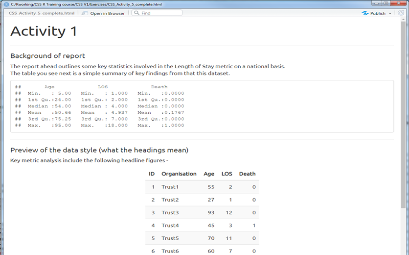
  <figcaption> How the 'united' theme appears on output </figcaption>
</figure>

--

## Activity 
<br>
+ Try out a theme on your Markdown file instead of using CSS
+ Use the example on the previous slide to see how to do it
+ Remember to comment / hashtag out your CSS file reference in the YAML header


---

class: middle, left

# Lunch

---

# Recap

---

# Using R markdown with Office: Powerpoint

+ Uses Pandoc
+ Old versions of RStudio (< 1.2) don't support it
+ Headers will make new slide
+ Images / Tables occupy a whole slide
  - Use captions and titles to provide text
+ Change formatting with styles (see Word section)
+ Can be useful, but we prefer Xaringan

---

# Using R markdown with Office: Word Documents

.pull-left[
+ Available by default
+ Not all features will work in the Word file (e.g. interactive figures)
+ Uses Word styles to format content
]

.pull-right[
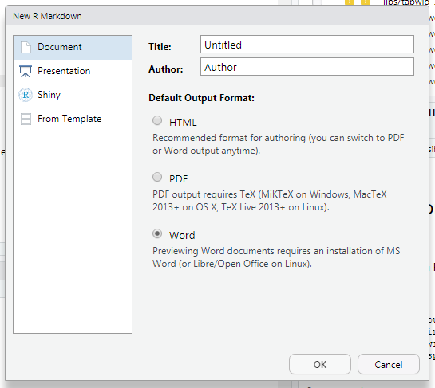
]

---
# Customising Word Documents

+ Provide a 'style guide' .docx file in the YAML header

--

```{r yaml_word, eval = FALSE}
---
title: "Word Report"
author: "J. Smith"
date: "01-01-2000"
output: #<<
  word_document: #<<
    reference_docx: style-guide.docx #<<
---
```

--

+ File content doesn't matter, just the styles

---

# Exercise 9 - Make a Document & Style Guide

+ Create a new Word file with Rmarkdown
+ Copy the file and call it 'style-guide.docx'
+ Open in Word and change the **styles**
+ Save it and make it the reference_docx in the YAML
+ Knit the original document and view the changes.

---

# Redoc: Word and Rmarkdown in the same file

+ Experimental
+ Creates Word documents with the raw Rmarkdown hidden inside
+ Keeps comments and changes made in Word
+ Can be converted back into Rmarkdown to work on it again


---

# Parameters:

Here's where it gets even more useful.  If you have a report that you need to repeat many times, you might want to use 'parameters'.

+ You may want to:
  + Run daily reports for different wards / gp practises
  + Change the key measure of a standard report
  + Change report dates etc.

--

You add parameters to your YAML header:

```{r yaml2, eval=FALSE}
---
title: "An introduction to Rmarkdown"
author: "Chris Mainey"
date: "16/05/2019"
output: 
  html_document
params: #<<
  Trust: "Trust1" #<<
---
```
--

+ ...then refer to them as if in a data.frame: `params$Trust`

---

# Exercise 10: 
### Build a parametrised `Rmarkdown` using `LOS_model`
 + Use the rmd file you made in exercise 2
 + Add a horizontal rule at the bottom
 + Add a summary and histogram for a single trust (instead of all of them).
 + Use a parameter in the YAML to select which trust
 + Change the title of the last section to include the name of the trust
 + Add a sentence at the end that says
    
    &#60;Trust Name&#62; has a length of stay which is &#60;shorter/longer&#62; than average

---

# Creating a batch

It is possible to generate each report by manually changing the parameters in the YAML header. But that is slow.

Create reports with different parameters using a `for` loop and the `render` function.

``` {r batch_reporting, eval = FALSE}

trusts <- c("trust1", "trust 2", "etc...")

for(trust_name in trusts){
  rmarkdown::render(input = "my_report.Rmd"
                    , output_file = file.path("report_batch"
                                              , paste("my_report_"
                                                      , trust_name
                                                      , sep = ""
                                                      )
                                              )
                    , params = list(Trust = trust_name) #<<
                    )
}
```

This will create a report for each trust in the `trusts` vector

The `params` argument must be in the format of a _named list_

Values in `params` will override values in the YAML header, but will keep any other values there.

Change the output file name or it will keep overwriting the same file!

---

# Exercise 11: 
### Create a batch of reports

+ Use a `for` loop inside an `Rmarkdown` document to build the report from the previous exercise for __all 10 trusts__ in the LOS_model data.
+ There is an unfinished Rmd file for exercise 11 if you want some help to get started.

---

# Fancier Stuff

There are lots of fancier things you can do, some of which require plugins, HTML or CSS but many don't.

.pull-left[
+ MathJax
+ LaTeX
+ Footnotes and annotations
+ BibTeX Bibliographies (including integration with zotero etc.)
+ `htmlWidgets` like interactive maps, paginated tables with filters
+ Shiny documents
+ Powerpoint and Word templates

]

.pull-right[
<br>
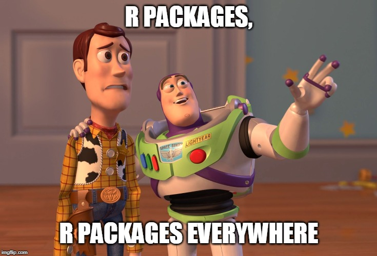
]


---

# Other 'down' formats:

+ `pagedown` - Page HTML files, shown earlier
+ `bookdown` - Create online books.  Many books written in this, including the Rmarkdown book and R4DS
+ `thesisdown` - Package for building academic theses in Rmarkdown
+ `blogdown` - Build websites using Rmarkdown and the static site generator 'Hugo'
+ `pkgdown` - Turn your documentaion and help files for an R package into a website
+ `xaringan` - Rmarkdown presentations using HTML slides. Like this one.

---

# Shiny Apps

Shiny apps can be included in an Rmarkdown document to make it interactive

--

<br>

Rmarkdown documents can be served by a Shiny Server to make accessing them as simple as following a link

--

<br>

Congratulations, you are now a web developer!

---


# Leaflet package

``` {r}

library(leaflet)

m <- leaflet() %>%
  addTiles() %>%  # Add default OpenStreetMap map tiles
  addMarkers(lng=-1.93917290996, lat=52.4510115293, popup="QE Hospital, Birmingham") # This uses the 'decimal degrees' measurement of longitude and latitude

m
```

---

# Using leaflet with purpose

+ By using the `LOS_model` that we have been using today, you could produce 'heat maps'or similar concepts to represent a distribution of data
+ I will add in a small, additional data frame with some longitude 
+ You could then use something like this to identify where there may be patterns


``` {r echo=FALSE}

latitude <-  c(52.47819,52.48372,52.4790)

longitude <-  c(-1.89984,-1.89837,-1.8925)

df <- data.frame(latitude,longitude)

m <- leaflet() %>%
  addTiles() %>%  # Add default OpenStreetMap map tiles
  addMarkers(data=df,lat= ~latitude,lng= ~longitude, popup="Cardiology patients with LOS above 4 days in the Birmingham area") # This uses the 'decimal degrees' measurement of longitude and latitude

m


```


---

# blogdown

Markdown can be used to create websites using `blogdown`.
<br><br>
Uses the `Hugo` static site generator, and a website theme.
<br><br>
Many themes to choose from and you can customise or write one yourself.

+ `Academic` is a common theme for CV type personal websites.
+ Themes are specific, so need to read about the one you choose
+ Publish for free via GitHub pages or Netlify
+ Don't `knit`! Use `blogdown::serve_site` to run

<br>
Post is a little old now, but CM used this to get started:
<br>
[https://alison.rbind.io/post/2017-06-12-up-and-running-with-blogdown/](https://alison.rbind.io/post/2017-06-12-up-and-running-with-blogdown/)

<br>
CM's website (Netlify): [www.mainard.co.uk](https://www.mainard.co.uk)<br>
Code (Github): [https://github.com/chrismainey/Mainard](https://github.com/chrismainey/Mainard)


---

## xaringan:  Rmarkdown presentations

You can build powerpoint, isoslides or other formats, but HTML seems to look best.
<br><br>

`xaringan` allows you to build markdown slides and create them using `remark.js`
<br><br>

Similar to normal markdown, but:

+ `---` divides sides
+ `--` reveals them incrementally
+  `class:` allows you to select a class for each slide
+ `.pull-left[]` is an examples sub-class that can be used to create a left column.
+ knit using `infinite_moon_reader`

Can use `xaringanthemer` package to easily write CSS for you:
[https://github.com/gadenbuie/xaringanthemer](https://github.com/gadenbuie/xaringanthemer)


### This presentation is built with `xaringan`

---

# Rmarkdown tips

+ Check the 'options' via the tools menu and check you are using `knitr` not `sweave`
+ You can `knit` to PDF or Word easily, but may need to install additional packages
+ You may need Latex installed on Windows, I use Miktex or `tinytex`
+ You can control lots of stuff using the YAML or chunk options
+ You can use `rmarkdown` with reference managers, e.g. Endnote or Zotero, using BibTeX
+ If it is part of data science, there is an R package for it.
+ R can access SQL databases directly. No more having to export results into Excel!

---

# Thanks!

`r icon::fa("envelope", color=rgb(148, 198, 0, maxColorValue = 255))` <a href="mailto:hed@uhb.nhs.uk;" style="line-height:2;"> hed@uhb.nhs.uk </a>
<br>
`r icon::fa("globe", color=rgb(148, 198, 0, maxColorValue = 255))` <a href="http://www.hed.nhs.uk" style="line-height:2;">http://www.hed.nhs.uk</a>
<br>
<br>
`r icon::fa("twitter", color=rgb(148, 198, 0, maxColorValue = 255))` <a href="https://twitter.com/chrismainey?s=09" style="line-height:2;">@chrismainey</a>
<br>
`r icon::fa("github", color=rgb(148, 198, 0, maxColorValue = 255))` <a href="https://github.com/chrismainey)" style="line-height:2;">chrismainey</a>
<br>

##### CM's personal website built in blogdown
`r icon::fa("globe", color=rgb(148, 198, 0, maxColorValue = 255))` <a href="http://www.mainard.co.uk" style="line-height:2;">http://www.mainard.co.uk</a>
<br>

##### MB's personal website built in blogdown
`r icon::fa("globe", color=rgb(148, 198, 0, maxColorValue = 255))` <a href="https://atomic-vector.netlify.com/" style="line-height:2;">https://atomic-vector.netlify.com/</a>

<br>
 `FunnelPlotR`  `r icon::fa("box")`  now available on CRAN!


